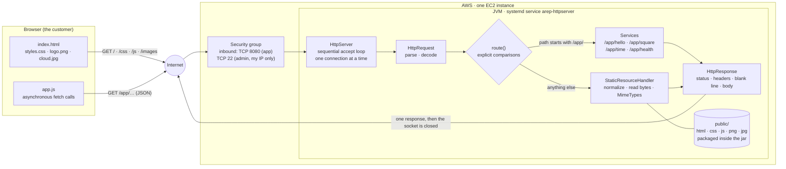
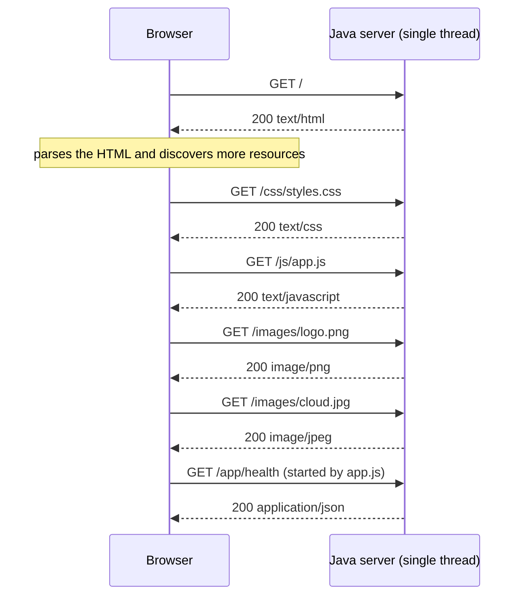

# From a Minimal HTTP Server to a Web Application on AWS

A small web application built on top of a **socket-based, deliberately sequential HTTP server
written in Java**, with no web framework and no runtime dependencies. It serves its own HTML page,
style sheet, script and images, exposes four hardcoded JSON services that the page consumes
asynchronously, and is packaged as a single jar that runs unchanged on a laptop or on one AWS EC2
instance.

The point of the exercise is not to build a fast server. It is to see clearly what **one** server
does: how a browser turns a single page into several HTTP requests, how a URL selects behaviour,
what a content type is for, and where requests start waiting when only one connection can be served
at a time. Concurrency, load balancing and autoscaling come later — and they only make sense once
this baseline is understood.

```
Correct HTTP → Multiple resources → Stateless services → Remote deployment → Observe the limit
```

---

## Table of contents

1. [System metaphor and architecture](#1-system-metaphor-and-architecture)
2. [Design decisions](#2-design-decisions)
3. [Project structure](#3-project-structure)
4. [Prerequisites](#4-prerequisites)
5. [Installation and build](#5-installation-and-build)
6. [How to run it locally](#6-how-to-run-it-locally)
7. [How to use the application](#7-how-to-use-the-application)
8. [How to run the tests](#8-how-to-run-the-tests)
9. [AWS deployment](#9-aws-deployment-one-ec2-instance)
10. [Evidence and results](#10-evidence-and-results)
11. [Known limitations](#11-known-limitations)
12. [Author and acknowledgements](#12-author-and-acknowledgements)

---

## 1. System metaphor and architecture

### The metaphor: a post office with a single window

Extreme Programming asks for a **system metaphor**: one shared analogy that lets a new developer
guess where things are without reading every class. This project is a **post office branch that has
exactly one open window**.

| In the metaphor | In the system | Where it lives |
|---|---|---|
| The **customer** who walks in and can keep reading a newspaper while waiting | The browser, kept responsive by asynchronous `fetch` calls | `public/js/app.js` |
| The **queue at the door** | The TCP accept queue: connections that arrived but have not been attended yet | operating system |
| The **single clerk** who attends one customer from beginning to end | The single server thread: `accept` → read request → answer → close → `accept` again | `HttpServer.serve()` |
| **Understanding what the customer says** | Parsing the request line, the headers and the query string | `HttpRequest` |
| The **filing cabinet of pre-printed forms** | The public resources area: page, style sheet, script, images | `src/main/resources/public/` |
| The clerk **checking the form is not from another office** | Path normalization: any `..` is rejected before a file is opened | `StaticResourceHandler.normalize()` |
| The **label on each form** that says what it is | The `Content-Type` header chosen from the file extension | `MimeTypes` |
| The **four things the clerk knows by heart** | The hardcoded services: greeting, square, time, health | `Services` |
| The **stamped receipt** handed back | The HTTP response: status, headers, blank line, body | `HttpResponse` |
| The **branch office** the counter was moved to | One EC2 instance, reached through its security group | `deploy/` |

The metaphor also explains the limitation the laboratory wants to expose: the customer being able to
read a newspaper while waiting (asynchronous client) does not add a second clerk (concurrent
server). If the person at the window asks for something slow, everybody else waits at the door —
no matter how patient or how busy they are.

### Architecture



**Responsibility of every component**

- **`HttpServer`** — owns the lifecycle. Binds the listening socket to `0.0.0.0` on a configurable
  port, and then loops: accept one connection, serve it completely, close it, accept the next one.
  It also contains `route()`, the explicit chain of comparisons that decides between a service and a
  file. A failure inside one connection is caught there and never reaches the loop.
- **`HttpRequest`** — turns bytes into a request: method, target, version, headers, decoded path and
  decoded query parameters. It reads the stream byte by byte so the end of the header block is
  unambiguous, and it rejects anything malformed with `BadRequestException`.
- **`HttpResponse`** — one in-memory response whose body is *always* a `byte[]`. It writes the
  status line, the headers, the mandatory blank line and the body, deriving `Content-Length` from
  the real byte count.
- **`StaticResourceHandler`** — resolves a path inside the public area, rejects traversal, reads the
  file as bytes and pairs it with its content type. Resources are read from the classpath (inside
  the jar), optionally overridden by an external directory.
- **`MimeTypes`** — the extension → content type table.
- **`Services`** — the four hardcoded services plus `/app/slow`, each a plain static method.
- **`Json`** — escaping, so a value typed by a user can never break the document.
- **`public/js/app.js`** — the asynchronous client: validates input, builds the URL, sends the
  request, shows a loading state, checks the status before reading the body and updates only the
  result or the error area.

### What one page view actually costs

Opening the home page produces **five** requests before any service is called, and the sequential
server answers them one after another:



With 100 students opening the page at the same time, that is already 600 requests standing in one
queue in front of one clerk.

---

## 2. Design decisions

**Why the server stays sequential.** It is the subject of the laboratory, not an oversight. A
single-threaded `accept` loop makes the cost of every request visible: the log prints them in the
exact order they were served, and a slow request visibly blocks the next one (see
[`docs/evidence/local-sequential-limit.txt`](docs/evidence/local-sequential-limit.txt)). Adding a
thread pool would hide the very behaviour that motivates the next architectural step. The
limitation is therefore preserved on purpose, and measured instead of avoided.

**Why the routes are hardcoded.** `HttpServer.route()` is a chain of `if (path.equals(...))`. There
is no routing table, no reflection, no annotation scanning and no dependency injection. The purpose
is to expose the mechanism that a framework would later generalise: a URL selects a piece of
behaviour. Written by hand, that mapping is three lines you can read; hidden behind a framework, it
becomes something you have to trust. Everything the chain does not match falls through to the
static resource handler, and any unmatched path under `/app/` returns 404 rather than falling back
to a file.

**How content types are selected.** From the file extension, through the explicit table in
`MimeTypes`, defaulting to `application/octet-stream`. The browser does not inspect the file name
or guess from the bytes: it obeys the header. The same bytes are a page, a script or an image
depending only on what the server declares — which is also why the dynamic services are careful to
answer `application/json; charset=utf-8`.

**Why everything is read as bytes.** Text and binary resources follow one single path to the socket.
Reading an image through a `Reader` would corrupt it — character decoding is lossy for arbitrary
bytes — and computing `Content-Length` from `String.length()` would be wrong for every non-ASCII
page. `HttpResponse` therefore only knows `byte[]`, and the length always comes from
`body.length`.

**How unsafe paths are rejected.** In three layers:

1. `HttpRequest` decodes percent-encoding **before** any check, so `%2e%2e%2f` becomes `../` and
   cannot smuggle a traversal past a naive string comparison.
2. `StaticResourceHandler.normalize()` walks the segments and **rejects** any `..` instead of
   resolving it, and refuses backslashes, NUL bytes and non-absolute paths. Rejecting is stricter
   than resolving: there is no arithmetic left to get wrong.
3. When an external resources directory is configured, the resolved file must still start with the
   root directory, so even a symlink-shaped surprise cannot escape.

The answer is `403 Forbidden` with a generic message; the requested path is never echoed back into
a body that could disclose what exists.

**Why the browser client is asynchronous.** A page that reloads on every action loses its state and
makes the round trip visible as a flash. `fetch` keeps the document alive: the click is intercepted
with `preventDefault()`, a loading state appears, and only the result area changes when the answer
arrives. It also separates two failure modes that look identical to a user and are completely
different to a developer — *the server answered with an error* (400, 404, 405: there is a status and
a message) and *the server did not answer at all* (network failure or timeout).

**Why the artifact carries its own resources.** The public files live under `src/main/resources`,
so `mvn package` produces one jar that is the entire application. Deployment is `scp` of a single
file; there is nothing to forget to copy. An external directory can still be pointed at with
`STATIC_DIR` when you want to change a page without rebuilding.

**Why the port is configuration.** `--port=` or the `PORT` variable, never a literal. That is what
makes "the same application tested locally" and "the application on EC2" the same artifact.

---

## 3. Project structure

```
.
├── pom.xml                          Maven descriptor (Java 17, JUnit 5, jar with a Main-Class)
├── README.md
├── .gitignore                       build output, IDE/OS metadata, logs, keys, credentials
├── src
│   ├── main
│   │   ├── java/edu/escuelaing/arep/httpserver/
│   │   │   ├── HttpServer.java              lifecycle, sequential loop and route()
│   │   │   ├── HttpRequest.java             request line, headers, query, decoding
│   │   │   ├── HttpResponse.java            status, headers, byte body, Content-Length
│   │   │   ├── HttpStatus.java              the status codes this lab produces
│   │   │   ├── StaticResourceHandler.java   safe paths and file reading
│   │   │   ├── MimeTypes.java               extension → content type
│   │   │   ├── Services.java                the hardcoded services
│   │   │   ├── Json.java                    escaping and small object rendering
│   │   │   ├── BadRequestException.java
│   │   │   └── UnsafePathException.java
│   │   └── resources/public/                the public resources area, packaged in the jar
│   │       ├── index.html
│   │       ├── css/styles.css
│   │       ├── js/app.js
│   │       └── images/logo.png, images/cloud.jpg
│   └── test/java/edu/escuelaing/arep/httpserver/
│       ├── HttpRequestTest.java             parsing and malformed input
│       ├── MimeTypesTest.java               the content type table
│       ├── StaticResourceHandlerTest.java   normalization, traversal, images, lengths
│       ├── ServicesTest.java                valid answers and rejected input
│       ├── JsonTest.java                    escaping
│       └── HttpServerIntegrationTest.java   the real server over real sockets
├── deploy
│   ├── arep-httpserver.service      systemd unit for the EC2 instance
│   ├── install-on-ec2.sh            installs the runtime, the jar and the service
│   └── upload.sh                    copies the artifact to the instance
├── scripts
│   ├── evidence.sh                  runs the functional matrix against any base URL
│   └── sequential-demo.sh           measures the sequential limitation with two clients
└── docs
    ├── DISCUSSION.md                answers to the eight discussion questions
    └── evidence/                    captured output and screenshots
```

Application code, tests and public resources are kept in the three separate Maven locations:
`src/main/java`, `src/test/java` and `src/main/resources`.

---

## 4. Prerequisites

| Tool | Version | Notes |
|---|---|---|
| JDK | **17 or newer** | The project is compiled with `--release 17`; it was developed on OpenJDK 21. |
| Maven | **3.8 or newer** | Build and dependency management. |
| curl | any | Only for the evidence scripts. |
| A modern browser | any | `fetch` and `AbortController` are used without polyfills. |

No runtime dependency is downloaded: JUnit 5 is the only dependency and its scope is `test`.

```bash
java -version   # 17+
mvn -v
```

---

## 5. Installation and build

```bash
# 1. Clone
git clone https://github.com/Isaac1805BC/Minimal-HTTP-Server-to-a-Web-Application-on-AWS-is-due.git
cd Minimal-HTTP-Server-to-a-Web-Application-on-AWS-is-due

# 2. Resolve dependencies (offline afterwards)
mvn dependency:resolve

# 3. Run the tests
mvn test

# 4. Produce the deployable artifact
mvn clean package
# -> target/arep-httpserver.jar   (contains the classes and the public resources)
```

---

## 6. How to run it locally

```bash
# Default port 8080
java -jar target/arep-httpserver.jar

# Another port, as an argument or as an environment variable
java -jar target/arep-httpserver.jar --port=9090
PORT=9090 java -jar target/arep-httpserver.jar

# Serve the public files from a directory instead of from the jar
STATIC_DIR=src/main/resources/public java -jar target/arep-httpserver.jar
```

Alternatively, without packaging: `mvn compile exec:java`.

Then open **<http://localhost:8080/>**.

The server prints one line per request:

```
[2026-09-09T19:32:08] 127.0.0.1 GET /images/logo.png HTTP/1.1 -> 200 image/png 11770B 0ms
```

**Configuration**

| Setting | Argument | Variable | Default |
|---|---|---|---|
| Listening port | `--port=N` | `PORT` | `8080` |
| External resources directory | `--static-dir=PATH` | `STATIC_DIR` | none (uses the jar) |

**To stop it**: `Ctrl+C`. The shutdown hook closes the listening socket; every client socket was
already closed when its response finished.

---

## 7. How to use the application

The home page is the client. Nothing on it reloads the page.

| Action | Request it sends | Answer |
|---|---|---|
| Type a name and press **Greet** | `GET /app/hello?name=Ada%20Lovelace` | `{"service":"greeting","name":"Ada Lovelace","message":"Hello, Ada Lovelace!"}` |
| Type a number and press **Square it** | `GET /app/square?value=12` | `{"service":"square","value":12,"square":144}` |
| Press **Ask the server** | `GET /app/time` | `{"service":"server-time","iso8601":"…","readable":"…","zone":"America/Bogota","epochMillis":…}` |
| Press **Show browser clock** | *(no request)* | the local clock, for comparison with the server clock |
| Press **Run a slow request** | `GET /app/slow?ms=5000` | answers after five seconds — used to observe the sequential limit |
| Automatic, on page load | `GET /app/health` | `{"status":"UP","uptimeMillis":…,"uptime":"0h 03m 12s"}` |

### The service URLs

| URL | Input | Success | Errors |
|---|---|---|---|
| `/app/hello` | `name`, required, 1–64 characters | `200 application/json` | `400` when missing, empty or too long |
| `/app/square` | `value`, required, any finite number | `200 application/json` | `400` when missing, not a number, infinite, or when the square overflows |
| `/app/time` | none | `200 application/json` | — |
| `/app/health` | none | `200 application/json` | — |
| `/app/slow` | `ms`, optional, 0–15000 (default 5000) | `200` after the delay | `400` when it is not an integer or is out of range |

Everything that is not one of those paths is looked up in the public area.

### Error behaviour

| Situation | Server | What the page shows |
|---|---|---|
| Empty field | *(no request is sent)* | "Type a name before asking for a greeting." |
| Missing or invalid parameter | `400` + JSON `message` | the message from the service, in the error area |
| Unknown file | `404` + HTML page | the browser shows the 404 page |
| Unknown service under `/app/` | `404` + JSON | the message from the service |
| `POST`, `PUT`, `DELETE`… | `405` + `Allow: GET` | the message from the service |
| Path traversal | `403` + JSON, nothing disclosed | the message from the service |
| Server stopped | *(no response at all)* | "The server could not be reached. Check that it is running." |
| Answer takes longer than 20 s | *(request aborted by the client)* | "The server took too long to answer." |

Raw bodies, stack traces and internal paths are never displayed.

---

## 8. How to run the tests

### Automated

```bash
mvn test
```

**81 tests**, all in `src/test/java`, separate from the application source:

| Suite | What it verifies |
|---|---|
| `HttpRequestTest` | request line, headers, query decoding (`%20`, `+`, UTF-8), and every malformed input that must become a `400` |
| `MimeTypesTest` | the extension → content type table, case insensitivity and the fallback |
| `StaticResourceHandlerTest` | normalization, traversal (plain, percent-encoded and through an external directory), the PNG/JPEG signatures, and that the declared length is the byte count |
| `ServicesTest` | valid answers, missing/invalid parameters, and that a hostile name cannot break the JSON |
| `JsonTest` | escaping of quotes, backslashes, control characters and markup |
| `HttpServerIntegrationTest` | the real server over real sockets: all static resources, the four services, `400`/`403`/`404`/`405`, a malformed request that does not stop the loop, and thirteen consecutive operations in one server run |

> The integration test starts the server in a background thread **of the test**, only because the
> test also has to act as the client. The server itself remains single-threaded and every request is
> sent one after another.

### Manual

```bash
# 1. Start the server
java -jar target/arep-httpserver.jar

# 2. The functional matrix of section 6.1 (status, content type and length of every case)
./scripts/evidence.sh http://localhost:8080

# 3. The sequential limitation of section 6.2 (two clients, measured)
./scripts/sequential-demo.sh http://localhost:8080
```

Both scripts take any base URL, so the same commands validate the EC2 deployment:
`./scripts/evidence.sh http://<public address>:8080`.

In the browser, open the developer tools **Network** panel and reload: the page, the style sheet,
the script and both images appear as separate requests with their own content types, and each
button adds one `application/json` request without a page reload.

---

## 9. AWS deployment (one EC2 instance)

The same artifact that was tested locally is deployed. Only the host and the network boundary
change — not the architecture.

> Use the account, region, image and instance type approved by the instructor. A running instance
> can generate charges. **No key, address or credential belongs in this repository.**

### 9.1 Launch the instance

1. EC2 → **Launch instance**, one Linux instance (Amazon Linux 2023), smallest approved type
   (`t2.micro` / `t3.micro`), default VPC and public subnet.
2. Name tag: something like `arep-lab2-sequential-server`.
3. Connection method: Session Manager, EC2 Instance Connect or SSH.
4. **Security group** — the instance firewall. Two inbound rules only:

   | Type | Protocol | Port | Source | Why |
   |---|---|---|---|---|
   | SSH | TCP | 22 | **My IP** | administration, never `0.0.0.0/0` |
   | Custom TCP | TCP | 8080 | `0.0.0.0/0` (or the range the instructor allows) | the application |

### 9.2 Upload, install and start

```bash
# On your computer, from the repository root
mvn clean package
./deploy/upload.sh ec2-user@<public address> ~/.ssh/<your key>.pem

# On the instance
sudo APP_PORT=8080 bash /tmp/install-on-ec2.sh /tmp/arep-httpserver.jar
```

`install-on-ec2.sh` installs a Java 17 runtime, creates the `arep` service account and
`/opt/arep`, copies the jar, installs the systemd unit with the chosen port and starts the service.
It finishes by calling the health service **from inside the instance**, so a failure is diagnosed
before the security group is ever blamed:

```bash
curl http://127.0.0.1:8080/app/health     # from the instance
```

### 9.3 Running after logout

The application runs as the systemd service `arep-httpserver`, which starts on boot, keeps running
after the administration session closes, and writes to a known location:

```bash
sudo systemctl status arep-httpserver
sudo systemctl restart arep-httpserver
sudo systemctl stop arep-httpserver
tail -f /var/log/arep/server.log          # or: sudo journalctl -u arep-httpserver -f
```

### 9.4 Verify from your computer

```
http://<the instance public address>:8080/
```

The page must load its script and both images from EC2, and the three dynamic services must answer
through the public address. `/app/time` now returns the clock of the instance, not yours.

```bash
./scripts/evidence.sh http://<public address>:8080 | tee docs/evidence/ec2-functional-matrix.txt
./scripts/sequential-demo.sh http://<public address>:8080 | tee docs/evidence/ec2-sequential-limit.txt
```

### 9.5 Mandatory cleanup

1. `sudo systemctl stop arep-httpserver`, keeping only the logs or screenshots needed for the
   submission.
2. **Terminate** the instance and confirm the state becomes `terminated`.
3. Release the Elastic IP, if one was allocated.
4. Delete the laboratory security group once no instance uses it.
5. Check the billing view of the learner account.

---

## 10. Evidence and results

Captured with the scripts in `scripts/`, against the local server:

| File | What it shows |
|---|---|
| [`docs/evidence/local-functional-matrix.txt`](docs/evidence/local-functional-matrix.txt) | every case of the section 6.1 matrix with its status, content type and byte count |
| [`docs/evidence/local-sequential-limit.txt`](docs/evidence/local-sequential-limit.txt) | two clients measured: the second waited 4504 ms for a request that costs ~1 ms |
| [`docs/evidence/local-server-console.txt`](docs/evidence/local-server-console.txt) | the server log of the whole session, in the exact order requests were served |
| `docs/evidence/*.png` | screenshots — see [`docs/evidence/README.md`](docs/evidence/README.md) for the list to capture |

Static resources and services, locally:

```
200    GET /                                  text/html; charset=utf-8                 6710  ok
200    GET /css/styles.css                    text/css; charset=utf-8                  6546  ok
200    GET /js/app.js                         text/javascript; charset=utf-8           9217  ok
200    GET /images/logo.png                   image/png                               11770  ok
200    GET /images/cloud.jpg                  image/jpeg                              45766  ok
200    GET /app/hello?name=Ada%20Lovelace     application/json; charset=utf-8            77  ok
400    GET /app/square?value=abc              application/json; charset=utf-8            88  ok
405    POST /app/hello?name=Ada               application/json; charset=utf-8            86  ok
403    GET /%2e%2e/%2e%2e/etc/passwd          application/json                             ok, rejected
15/15 succeeded against the same running process.
```

The sequential limitation, measured:

```
19:33:27.314  client A  ->  GET /app/slow?ms=5000
19:33:27.815  client B  ->  GET /app/time   (a request that costs nothing)
19:33:32.321  client A  <-  answered after 5006 ms
19:33:32.321  client B  <-  answered after 4504 ms
```

The server log proves the cause: client B's request was not *slow*, it was *late to be served*.

```
19:33:32.319  GET /app/slow?ms=5000 -> 200 … 5001ms
19:33:32.319  GET /app/time         -> 200 … 0ms      <- took 0 ms, but the client had waited 4.5 s
```

The eight discussion questions are answered in **[`docs/DISCUSSION.md`](docs/DISCUSSION.md)**.

---

## 11. Known limitations

This is a teaching server, not a production one.

- **Sequential by design.** One thread, one connection at a time. There is no thread pool, no queue
  and no non-blocking I/O. Throughput is one request at a time, and a slow request blocks everyone.
- **One instance.** One capacity limit and one point of failure. No load balancer, no autoscaling.
- **`GET` only.** Every other method answers `405`. No request body is read.
- **Four hardcoded services.** No routing framework, no path parameters, no content negotiation.
- **HTTP/1.1 without persistent connections.** Every response closes the socket; keep-alive,
  chunked transfer, ranges, compression, conditional requests and caching are not implemented.
- **No TLS.** Plain HTTP; the application must not carry anything sensitive.
- **No state.** No sessions, no database, no authentication. Nothing a user types survives the
  response — which is what makes the server trivially replaceable later.
- **Minimal hardening only.** Line and header limits, a client timeout, path rejection and JSON
  escaping. It has not been reviewed against a hostile internet.

The next architectural step is **concurrency**, not load balancing: distributing traffic across
copies of a server that can only do one thing at a time simply buys N times one — and each copy
would still stall the moment a single request takes long.

---

## 12. Author and acknowledgements

**Isaac Burgos** — Escuela Colombiana de Ingeniería Julio Garavito.
Architectures of Enterprise Software (AREP) / TDSE — networking laboratory, part 2.

Built with:

- Java SE (`java.net.ServerSocket`, `java.net.Socket`, `java.nio.file`) — no web framework.
- [Apache Maven](https://maven.apache.org/) for build and dependency management.
- [JUnit 5](https://junit.org/junit5/) for the automated tests.

Reference documentation:

- [RFC 9110 — HTTP Semantics](https://www.rfc-editor.org/rfc/rfc9110.html) and
  [RFC 9112 — HTTP/1.1](https://www.rfc-editor.org/rfc/rfc9112.html)
- [MDN — Using `fetch`](https://developer.mozilla.org/en-US/docs/Web/API/Fetch_API/Using_Fetch) and
  [MIME types](https://developer.mozilla.org/en-US/docs/Web/HTTP/Basics_of_HTTP/MIME_types)
- [Launch an Amazon EC2 instance](https://docs.aws.amazon.com/AWSEC2/latest/UserGuide/EC2_GetStarted.html)
- [Connect to your Linux instance](https://docs.aws.amazon.com/AWSEC2/latest/UserGuide/connect-to-linux-instance.html)
- [Security group rules for different use cases](https://docs.aws.amazon.com/AWSEC2/latest/UserGuide/security-group-rules-reference.html)
- Laboratory statement: *From a Minimal HTTP Server to a Web Application on AWS*, networking guide
  section 4.4 onwards.
